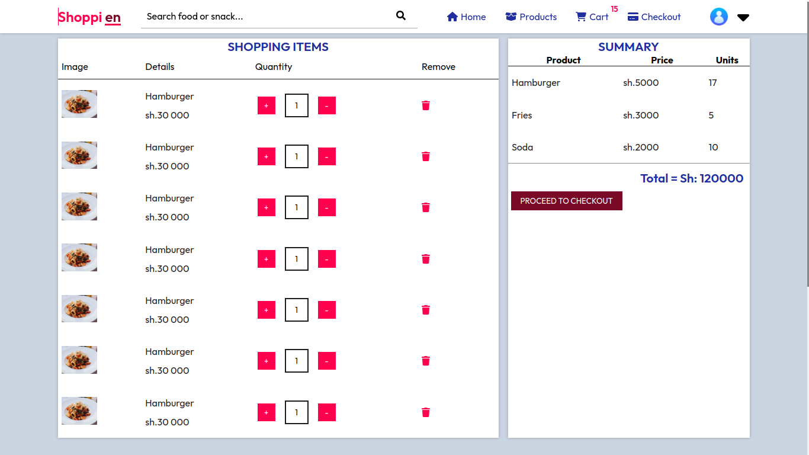

# Emali Bakers - Online Food Delivery App for Factories

## Project Overview

**Emali Bakers** is an online food delivery system built to automate the process of ordering and delivering products (like bread and snacks) to retailers across the country. This system is designed to simplify the interaction between factories and retailers by allowing small retailers to place orders online, track their deliveries, and make payments securely. Drivers will handle the delivery of the products using lorries, motorbikes, or pickups but will no longer handle payments.

The retailers can pay for their orders using secure online payment gateways such as Daraja API (M-Pesa) or Stripe. The system ensures transparency, accountability, and efficiency in the ordering and delivery process. **Firebase** is used to store product images for display in the product catalog.

## Features

- **Retailer Registration/Login**: Retailers can sign up and log in to place their orders.
- **Product Catalog**: Displays a list of available products (with images stored in Firebase) for retailers to browse and add to their cart.
- **Order Management**: Retailers can place and track orders online.
- **Payment Integration**: Secure payments through Daraja API (M-Pesa) or Stripe.
- **Delivery Management**: Drivers are assigned orders for delivery, and delivery statuses are tracked.
- **Admin Dashboard**: Admins can manage products, view orders, monitor delivery progress, and upload product images to Firebase.
- **Real-time Notifications**: Retailers receive notifications when their orders are updated or delivered.
- **Secure Authentication**: Utilizes JWT tokens for secure user authentication.

## Tech Stack

- **Frontend**: React, Redux Toolkit, Axios, TailwindCSS
- **Backend**: Node.js, Express, MongoDB, Mongoose
- **Payment Gateways**: Daraja API (M-Pesa), Stripe
- **Image Storage**: Firebase for product image storage
- **Authentication**: JSON Web Tokens (JWT)
- **Deployment**: Heroku/Netlify
- **Version Control**: Git, GitHub

## Project Status

The system is still under development, and additional features are being implemented.

## Screenshots

## Home page


## Shopping cart page



## Users admin page


## Running the Available Features Locally

To run this project locally, follow these steps:

**Clone the repository:**

   ```bash
   git clone https://github.com/Ritahchanger/Emali_bakers.git
   cd Emali_bakers

   ```

**Install dependencies:**

### for client

cd client
npm install

### server

cd ../server
npm install

**For environment variables:**

create a .env file in the server folder and add the following `

```javascript
MONGO_URI=mongodb://127.0.0.1:27017/emali_bakers
JWT_SECRET=your_jwt_secret
PORT=5000

STRIPE_SECRET_KEY=

FIREBASE_CREDENTIALS=

SAFARICOM_CONSUMER_KEY=

SAFARICOM_CONSUMER_SECRET=

SAFARICOM_STK_PUSH_PASS_KEY=

LIPA_NA_MPESA_URL=https://sandbox.safaricom.co.ke/mpesa/stkpush/v1/processrequest

```

## Run the application: ##
**inside the client folder**
```
npm run start
```
**inside the client folder**
   inside the backend folder 
```
npm run dev
```
